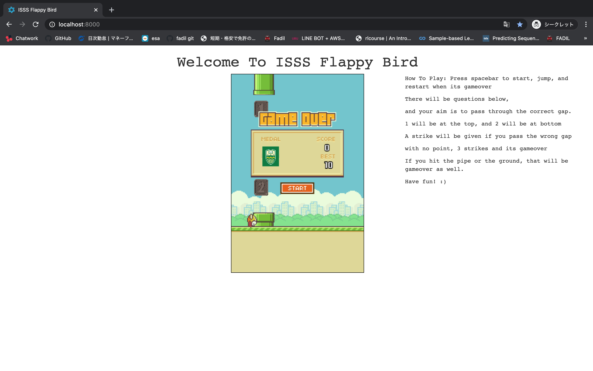

# ISSS Flappy Bird
Heavily Tweaked Flappy Bird Taken From 
[CodeExplainedRepo](https://github.com/CodeExplainedRepo/Original-Flappy-bird-JavaScript)

## Why
This is created for the ISSS science week at University of Alberta. 

## How To Play
Simply just press spacebar to fly, just like a normal flappy bird. There will be questions below, and your goal is to go through the correct pipes by answering the questions.

## Gameover
If you hit the pipes, thats instantly gameover, and if you pass the wrong gap, you will have a strike. 3 strikes you are out.
## Screenshot

